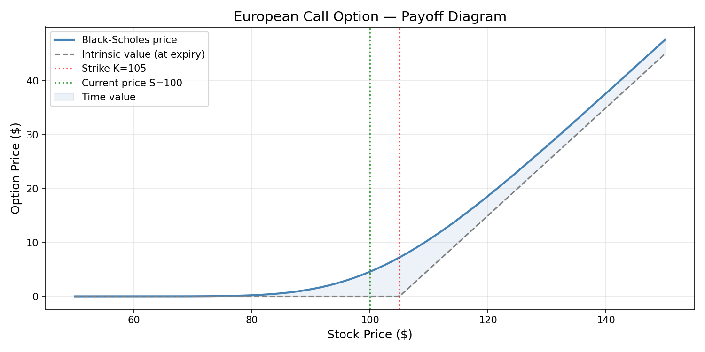
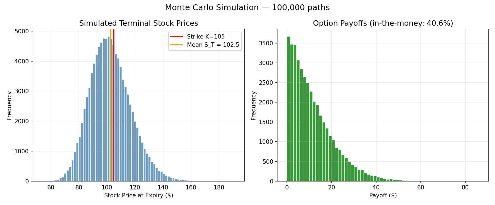
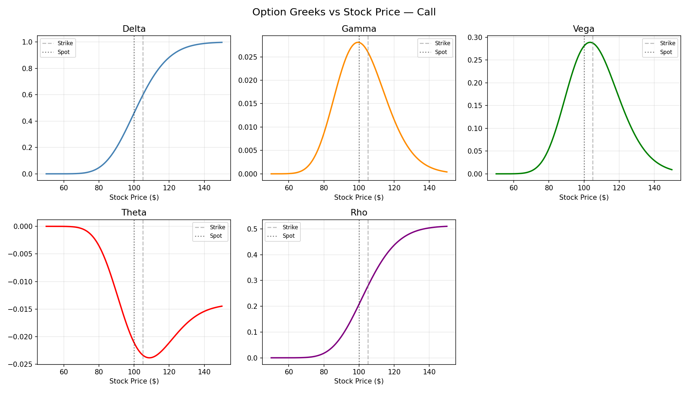

# Options Pricer — Black-Scholes & Monte Carlo

A Python implementation of European options pricing using two methods: the **Black-Scholes closed-form solution** and **Monte Carlo simulation**. Includes calculation of all five major Greeks.

Built as part of an MSc Quantitative Finance portfolio at the University of Kiel.

---

## What this project covers

| Topic | Description |
|---|---|
| Black-Scholes model | Analytical pricing of European calls and puts |
| Monte Carlo simulation | 100,000-path numerical pricing with confidence intervals |
| The Greeks | Delta, Gamma, Vega, Theta, Rho — all computed and visualised |
| Visualisations | Payoff diagram, MC distribution, Greeks vs spot price |

---

## Charts

### Payoff Diagram


### Monte Carlo Simulation


### Option Greeks


---

## Theory

### Black-Scholes

Assumes stock price follows Geometric Brownian Motion:

```
dS = μS dt + σS dW
```

The closed-form price of a European call is:

```
C = S·N(d1) - K·e^(-rT)·N(d2)

d1 = [ln(S/K) + (r + σ²/2)·T] / (σ·√T)
d2 = d1 - σ·√T
```

### Monte Carlo

Simulates N terminal stock prices under the risk-neutral measure:

```
S_T = S · exp((r - σ²/2)·T + σ·√T·Z),  Z ~ N(0,1)
```

Averages discounted payoffs across all simulated paths.

---

## Usage

```bash
pip install numpy scipy matplotlib
python options_pricer.py
```

### Example output

```
EUROPEAN OPTIONS PRICER
Parameters:
  Stock price    S = 100
  Strike price   K = 105
  Time to expiry   = 0.5 years (6 months)
  Risk-free rate   = 5.0%
  Volatility       = 20.0%

BLACK-SCHOLES RESULT
  d1 = -0.0975  |  d2 = -0.2389
  Option price = 4.5817

GREEKS
  Delta = 0.4612  -> option moves 0.46 per $1 stock move
  Gamma = 0.0281  -> delta changes by 0.0281 per $1 move
  Vega  = 0.2808  -> price changes 0.2808 per 1% vol change
  Theta = -0.0211 -> option loses 0.0211 per day
  Rho   = 0.2077  -> price changes 0.2077 per 1% rate change

MONTE CARLO RESULT (100,000 simulations)
  Option price = 4.5952
  Std error    = 0.0259
  95% CI       = [4.5444, 4.6460]
  Difference from BS = 0.0135
```

---

## Key concepts demonstrated

**Delta** — How much the option price moves per $1 change in the stock.

**Gamma** — How fast delta changes. High gamma means the option is very sensitive near the strike.

**Vega** — Sensitivity to volatility. Buying options is implicitly a bet on volatility increasing.

**Theta** — Time decay. Options lose value every day as expiry approaches.

**Rho** — Sensitivity to interest rates.

---

## Next steps / extensions

- [ ] Implied volatility solver (given market price, solve for σ)
- [ ] American options pricing using Binomial Tree
- [ ] Volatility smile visualisation
- [ ] Delta-hedging simulation

---

## Author

Syed Mohammad Zaheen
MSc Quantitative Finance, University of Kiel
LinkedIn: [iamzaheen](https://linkedin.com/in/iamzaheen)
GitHub: [iamzaheen](https://github.com/iamzaheen)
